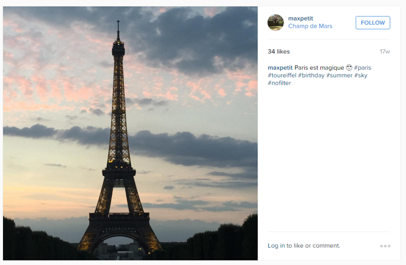
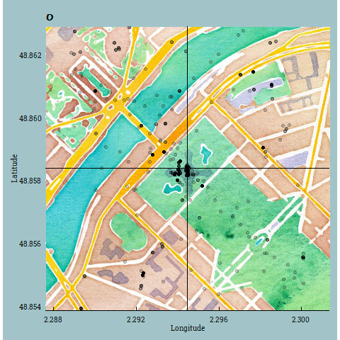

```{r setup, include=FALSE}
knitr::opts_chunk$set(echo = TRUE, fig.width=16, fig.height=9,warning=FALSE, message=FALSE)
library(parisgram) #private package
library(tidyverse)
library(lubridate)
library(ggmap)
library(DT)
library(extrafont)
library(stringi)
library(gganimate)
#loadfonts(device = "win")

library(ggthemes())
theme_set(theme_economist(base_family="Roboto Slab"))
theme_update(panel.background = element_rect(fill = "#a2c4c9",colour = "#a2c4c9", size = 0.5, linetype = "solid"), plot.background= element_rect(fill = "#a2c4c9",colour = "#a2c4c9", size = 0.5, linetype = "solid"), plot.title = element_text(family="Reenie Beanie", size=30))
data("raw_instagram_data")
```

## Why the Eiffel Tower?

One of the motivators for this exploration was a study undertaken by Crandall, Backstrom, Huttenlocher, and Kleinberg (2009)[^1], which analysed nearly 35 million images posted by over 300 000 users on Flicker during a six-month period. The study found that the most photographed monument in the world was the Eiffel Tower. 

Another motivator was Anna getting engaged at the Eiffel Tower at the start of the year the new course material was developed. Anna was interested in how similar photos of the Eiffel Tower were and needed a way to collect a large number of photos to investigate! So she set up the IFTTT applet to record Instagram posts made within 500m of the Eiffel Tower.

[^1]:Crandall, D. J., Backstrom, L., Huttenlocher, D., & Kleinberg, J. (2009). Mapping the world's photos. In Proceedings of the 18th international conference on World Wide Web (pp. 761-770). Association for Computing Machinery. http://www.cs.cornell.edu/~dph/papers/photomap-www09.pdf.


## What's in that photo?

After a brief explanation of how the data were collected (see [Data](data.html) for more details), students use the app embedded below to view a random selection of 10 of the photos from the Instagram posts.

<iframe width="100%" height="480" src="https://script.google.com/macros/s/AKfycbyJ9FZuKTli-kg0LWG8jZ7mbMkracvnMdC8z56QmfM0lt__OL7A/exec" frameborder="0" allowfullscreen></iframe>

The idea here is broaden students' ideas about data, in particular the use of images as data and of categorical variables. Also, checking what the photo is of, in particular whether the photo is of the Eiffel Tower (or another recognisable landmark), helps later in the exploration. Looking at the photos also helps to "humanise" the data, particularly when we discuss privacy issues.

## The city that never sleeps?

An interesting quirk of using the IFTTT service to record data about the Instagram posts in a Google sheet, was that the time recorded was based on Anna's timezone (Pacific/Auckland), not the time in Paris. This was discovered when Anna first explored the time of day the posts were being made.

Compare the total number of posts by hour of day without the time conversion:

```{r no-time-conversion}

raw_instagram_data %>% 
  mutate(datetime = mdy_hm(str_replace(date," at","")), hour = hour(datetime)) %>%
  group_by(hour) %>%
  summarise(count = n()) %>%
  ggplot(aes(x=hour, y=count)) + geom_line() + scale_x_continuous(breaks=seq(0,23,1), expand = c(0, 0))

```

To the total number of posts made by time of day with the time conversion:

```{r with-time-conversion}

raw_instagram_data %>% 
  mutate(datetime = with_tz(mdy_hm(str_replace(date," at",""),tz="Pacific/Auckland"),"Europe/Paris"), hour = hour(datetime)) %>%
  group_by(hour) %>%
  summarise(count = n()) %>%
  ggplot(aes(x=hour, y=count)) + geom_line() + scale_x_continuous(breaks=seq(0,23,1), expand = c(0, 0)) + scale_y_continuous(limits = c(0, 4000)) + labs(x = "Hour of day", y="Number of posts")

```

It totally looks like the first plot makes more sense, yet it's the one without the time conversions. To check (yet again!) that time conversions are needed, we can look closer at the data.

```{r animated-time}

plot<- raw_instagram_data %>% 
  mutate(datetime = with_tz(mdy_hm(str_replace(date," at",""),tz="Pacific/Auckland"),"Europe/Paris"), hour = hour(datetime)) %>%
  group_by(hour) %>%
  summarise(count = n()) %>%
  ggplot(aes(x=hour, y=count,frame = hour)) + geom_line(aes(cumulative = TRUE)) + scale_x_continuous(breaks=seq(0,23,1), expand = c(0, 0)) + scale_y_continuous(limits = c(0, 4000)) + labs(x = "Hour of day", y="Number of posts")

#gganimate(plot, interval = .2)
```


Here's the first 100 posts in the data set:
```{r first-ten}

raw_instagram_data %>% 
  head(100) %>%
  DT::datatable(options = list(pageLength = 10))

```

If we look at the first post, the time we have recorded is July 13 2015 8:47AM. If check out the Instagram post (https://instagram.com/p/5DM8lJFnuF/), the date is July 13th which is not that helpful but the photo displayed is a day time photo and could be around 9AM in the morning. If we view the page source for this post, we see that there is a JSON with more info about the time the post was created. (HINT: You can get straight to this by adding "?__a=1" to the end of the instaURL e.g. https://instagram.com/p/5DM8lJFnuF/?__a=1).


1436734040 is an UNIX timestamp, which gives the number of seconds that have elapsed since January 1, 1970 00:00 UTC.

```{r from-UNIX}

lubridate::with_tz(as.POSIXct(1436734040, origin="1970-01-01"),"Europe/Paris")

```

## #statistics?



What do people write about in their Instagram posts? How can we do analysis based on what people write, words? [not all students would think data can be something other than numbers or groups/categories]. We could do text analysis (big thing in the marketing world!) – but we will focus on the hashtags as a proxy for the key words or general feeling of the post. This one has more hashtags than writing!! Six hashtags for one post  Could analyse this – ratio of words written to hashtags used (could pull in a funny example that is mostly hashtags…) - and an EMoJI. Talk about how you get all the hashtags computationally...

Bias towards English words! How to fix this? Not use tidytext :-)

```{r hashtag-analysis}

hashtag_data <- raw_instagram_data %>%
  mutate(word = str_replace_all(text,"#"," #")) %>%
  separate_rows(word, sep=" ") %>%
  mutate(hashtag = stringi::stri_trans_tolower(word), hashtag_check = ifelse(substr(hashtag, 1, 1) == '#',"yes","no"))
  
hashtag_data %>%
  filter(hashtag_check == 'yes') %>%
  count(hashtag, sort=TRUE) %>%
  filter(n > 150) %>%
  mutate(hashtag = reorder(hashtag, n)) %>%
  slice(1:20) %>%
  ggplot() + geom_bar(aes(x=hashtag, y=n), stat="identity") + coord_flip() + scale_y_continuous(expand = c(0,0)) + labs(title="Top 20 hashtags", y = "Frequency")
  

```

Seems like pretty convincing stuff - but what proportion of these Instagram post contain no hashtags?

```{r hashtag-counts}

hashtag_data %>%
  group_by(date, user) %>%
  summarise(num_hashtags = sum(hashtag_check=="yes", na.rm = TRUE)) %>%
  ggplot(aes(x = num_hashtags)) + geom_bar()

# find a post with lots of hashtags!
raw_instagram_data %>%
   filter(instaURL == "https://www.instagram.com/p/BAE9rJYLlEQ/") %>%
  select(text) %>%
  pull()
```

> **Questions for students:** What do you think is the most popular hashtag? Do you think *love* features in the top ten hashtags?


## Location, location, location

The Eiffel Tower is located at longitude 2.294481, latitude 48.858370.

```{r initial-plot}
location_data <- raw_instagram_data %>%
mutate(lat = as.numeric(str_match(mapCoords, "=(.*?),")[,2]), lon = as.numeric(str_match(mapCoords, ",(.*?)\\&")[,2]), datetime = with_tz(mdy_hm(str_replace(date," at",""),tz="Pacific/Auckland"),"Europe/Paris"), hour = hour(datetime))

mapSetup <- get_map(location = c(2.294481, 48.858370), zoom = 16, maptype = "watercolor") 

map <- ggmap(mapSetup) +
  geom_point(data = location_data, aes(lon, lat, frame=hour), color = 'black', size = 2, alpha = 0.2) +
  xlab("Longitude") +
  ylab("Latitude") +
  geom_vline(xintercept = 2.294481) +
  geom_hline(yintercept =  48.858370)

#gganimate(map, "oolala.gif")
```


