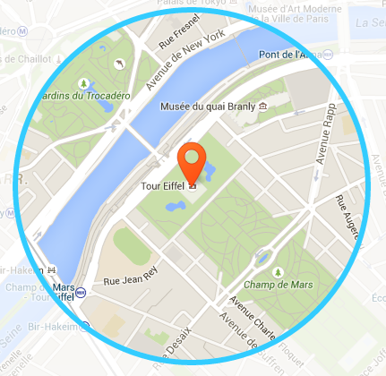

This site was created to support the paper *Exploring modern data in a large introductory statistic course*, which was presented at [ICOTS10](https://icots.info/10/) (Kyoto, Japan) by [Anna Fergusson](https://unidirectory.auckland.ac.nz/people/profile/a-fergusson) and [Liza Bolton](https://www.stat.auckland.ac.nz/people/ebol015). 

- [Talk](talk.html) provides the slides for our ICOTS talk.
- [Data](data.html) provides more information about how the Instagram and Twitter data were obtained.  
- [Explorations](draft.html) will provide examples of how the Instagram data are currently used for teaching, and ideas for future explorations.

#### paris (twit)ter (insta)gram

